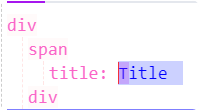
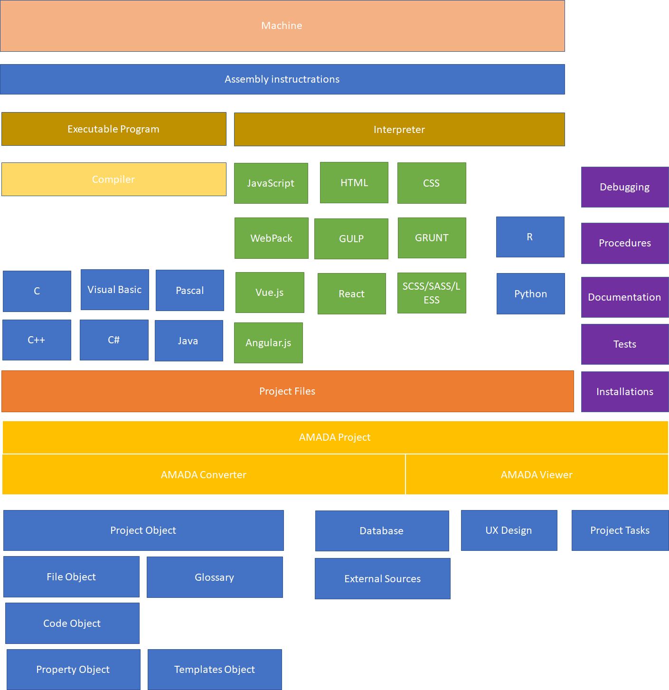
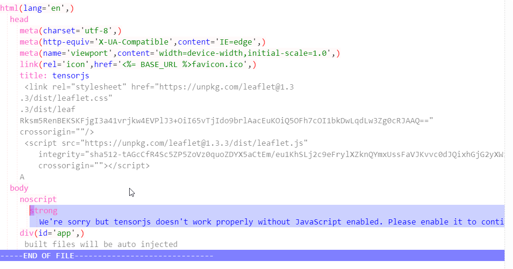
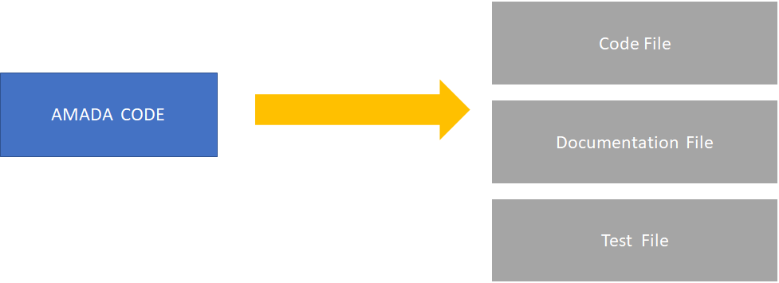
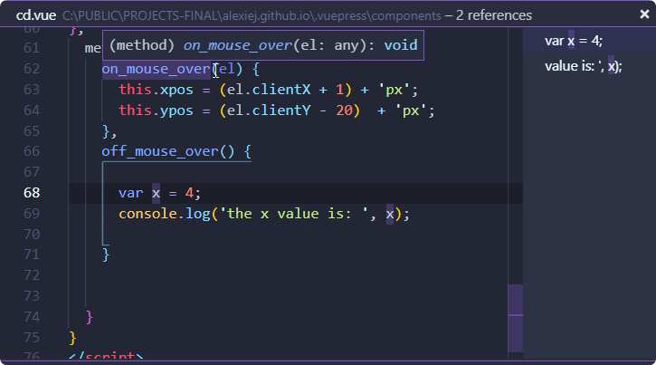

# AMADA  - The new concept of the the Code Editor

## Exclamation

The project is still in a very alpha stage. Bellow, I’ve described some concept and background that I wanted to be implemented.

## What it is?

AMADA is the new concept of the editor that instead of based on text in each file, is based on the structure that can next be transformed into each programming language. Instead of working on the code as a text. Developer work on the code like on the object database, with adding children/parents nodes and define properties. In this concept, there are two main rules writing a code.

### 1.  What you see is not what you get.

Usually, when you write a code it is what it goes to the compiler. If you write `int a = 3;` C compiler will get an `int a = 3`, but very often it is not true. In the **C language** there is a preprocessor and constructions `define`. In **node.js** you’ve got webpack that you can divide your code into smaller pieces. But this is based on the text that you write before, and configuration that you write before. The concept is more abstract. In this concept, you create an architecture of the code. Next, this code can be compiled into source files that can go further into **compiler**. In this concept, you decide how the source code will look. 

For example, You’ve got this structure. Normally you can write **html** file or **pug** file.  But on the background, it is a text file that you write instructions.



In the **AMADA** in the background, you’ve got a (for now`.json`) file with a structure of the code.  But you **don’t see** the whole `.json` source. You see only what is important to you. The architecture of the code.  You can add for example comments, and normally it will show up to the code, or on the right. But here the comments are not necessary and they can be shown whenever a user wants to. Normally when you want to do this in the regular IDE you need to have some regular expression before that recognize the comments. But here everything is an object, and when you want to hide comments you filter your code object with the comments.

In the output, it can be generated to the below example

```html
<!DOCTYPE HTML>
<html>
  <head></head>
  <body>
    <h3>My title</h3><!--COMMENTS-->
  </body>
</html>
```

This code is more clear and doesn’t have unnecessary open tags and close tags. In the **pug** project it is also possible to write in this style. But here there is an additional step forward and it is not required to use regular expressions or some compiler to convert into **html** file.

### 2. You cannot write whatever you want.

When you write for example **.html** file you cannot create the code with not close tag or open tag. But the truth is that you can. And whenever you made mistake the browser or IDE tell you that in the code you have a mistake. Very often it is really hard to find a mistake, missing comma or not closed brackets. Here it is impossible to make mistake with pointy brackets because they don’t exist. They are added when you save your file and the html file is generated. In the **pug** for example there is also possible to not write brackets, but you can still make mistakes but writing wrong commands or wrong **indentation**. The editor doesn’t allow you to write the wrong sentences. 

Another example is when you write a text in the commas. You cannot write comma inside comma because interpreter/compilator will think that it is an end of the text and you need to write this as `\"`, but you will know this only after compilation or when IDE can recognize this errors. But the AMADA converter will first translate the comma into the correct character. 

# Concept Background

## What have programmers done for the last 70 years?

The concept of programming doesn’t change since early first programming language COBOL or FORTRAN. A user writes down instructions that next are compiled into executable software. From the first assembler type programs that only what we can to do is writing instructions to the processor to the more complicated and more sophisticated software that we highly level languages like C++ or C# and next Java.

Let see a simple assembler program that moves 

```assembly
; https://github.com/AhmadNaserTurnkeySolutions/emu8086/blob/master/examples/HelloWorld.asm

name "hi"

org 100h
jmp start       ; jump over data declaration

msg:    db      "Hello, World!", 0Dh,0Ah, 24h
start:  mov     dx, msg  ; load offset of msg into dx.
        mov     ah, 09h  ; print function is 9.
        int     21h      ; do it!
        
        mov     ah, 0 
        int     16h      ; wait for any key....
        
ret ; return to operating system.
```

These instructions are simple. It prints out the `hello world!` text. Of course, this is the direct translation of the binary code that you have in the .exe or some executable file. Each byte of the machine code is the line of the code above. Writing this takes a lot of time. Assembler is a type of **2GL** language. 

## High-level programming language

Next step was with the High-level programming languages. Instead of writing instructions to the processor. You write instructions to the compiler that combine all files and translate them into executable code that can be run on the machine. Still, in this concept, we write a code in the text file `.cpp`, but it’s much simpler and you don’t have to know processor instructions.

```c
#include <stdio.h>

int main() {
    print("Hello world\n");
    return 0;
}
```

This is a type of **3GL** programming languages. 

## interpreters

Interpreters are the next layer from the program you write to the machine. Instead of compiling the software and next run executable software, first the interpreter translates the code into some middle-level assembler language that does not depend on the processor or the machine and next by the software translates into machine code. This is still **3GL** programming language, but you don’t have to worry any hardware stuff (e.g.  **Python**). For `javascript` the middleware software is the internet browser, and for python `python interpreter`.

## Bundle software

For the past years, JavaScript that is mostly used in the browsers come up very popular but became very complicated to write the whole page in a single file. To help produce code and not to worry about all dependencies packages, other codes, and libraries. This kind of software converts one `javascript` code into another `javascript` so the developer is not so overwhelmed with the whole structure.

Some of the programming languages use directives as a process before compiling a code:

```c++
// Macro to get a random integer with a specified range   
#define getrandom(min, max) \  
    ((rand()%(int)(((max) + 1)-(min)))+ (min)) 
```


The most problem with this is that software is not testable if the bug is inside directive. You have to work manually and process these directives before.

## 4GL programming languages

We cannot forget about 4GL programming languages like SQL, Matlab, R, etc…. that were created for specialists and specific areas.  They are very similar to the previous one like **3GL**, but in this situation, it requires less instruction that you write in the program.

## Visual programming language

There is also another type of languages called Visual Programming Languages that are very popular for children to teach programming without writing the code.  They are very good but very often they are limited to couple procedures, functions.  The other con for this software is that you use the mouse which slow down writing a code. 

## Engines

Most popular for games, and some simple applications you can use the engine. This is specialized software that generates the final code without thinking about architecture. The problem is that this software is only limited to a specified purpose. You cannot write with the Unreal Engine a website or taxing software.

## **Procedural Programming vs Object Oriented Programming**

**Procedural programming** is a [programming paradigm](https://en.wikipedia.org/wiki/Programming_paradigm), derived from [structured programming](https://en.wikipedia.org/wiki/Structured_programming), based upon the concept of the *procedure call*. Procedures, also known as routines, [subroutines](https://en.wikipedia.org/wiki/Subroutine), or [functions](https://en.wikipedia.org/wiki/Functional_programming), simply contain a series of computational steps to be carried out. Any given procedure might be called at any point during a program's execution, including by other procedures or itself. The first major procedural programming languages first appeared circa 1960, including [Fortran](https://en.wikipedia.org/wiki/Fortran), [ALGOL](https://en.wikipedia.org/wiki/ALGOL), [COBOL](https://en.wikipedia.org/wiki/COBOL) and [BASIC](https://en.wikipedia.org/wiki/BASIC).[[1\]](https://en.wikipedia.org/wiki/Procedural_programming#cite_note-:0-1) [Pascal](https://en.wikipedia.org/wiki/Pascal_(programming_language)) and [C](https://en.wikipedia.org/wiki/C_(programming_language)) were published closer to the 1970s.

**Object-oriented programming** (**OOP**) is a [programming paradigm](https://en.wikipedia.org/wiki/Programming_paradigm) based on the concept of "[objects](https://en.wikipedia.org/wiki/Object_(computer_science))", which may contain [data](https://en.wikipedia.org/wiki/Data), in the form of [fields](https://en.wikipedia.org/wiki/Field_(computer_science)), often known as *attributes;* and code, in the form of procedures, often known as *methods.* A feature of objects is that an object's procedures can access and often modify the data fields of the object with which they are associated (objects have a notion of "[this](https://en.wikipedia.org/wiki/This_(computer_programming))" or "self"). In OOP, computer programs are designed by making them out of objects that interact with one another.[[1\]](https://en.wikipedia.org/wiki/Object-oriented_programming#cite_note-1)[[2\]](https://en.wikipedia.org/wiki/Object-oriented_programming#cite_note-2) There is significant diversity of OOP languages, but the most popular ones are [class-based](https://en.wikipedia.org/wiki/Class-based_programming), meaning that objects are [instances](https://en.wikipedia.org/wiki/Instance_(computer_science)) of [classes](https://en.wikipedia.org/wiki/Class_(computer_science)), which typically also determine their [type](https://en.wikipedia.org/wiki/Data_type).

Both have some pros and cons. But finally, you can define both of them as some kind of preprocessing paradigm that prepares code structure for final programming. Is it OOP really good. sometimes is very complicated, and it’s really easy to overcomplicate the whole code with the structure of many classes and creating classes for everything. In the other hand in procedural programming, you write really fast at the very beginning but it’s really easy to create mess code, and organize everything in the code could be painful.

Working with the code as an object is similar to `Object-oriented programming (OOP)`.  But here the code is something more general and something that you can use everywhere. You don’t write the class, you write a code object. Even if the code was not prepared for the object type (for example: `html`, `assembler`). 

## What is a Software?

*A **computer program** is a collection of [instructions](https://en.wikipedia.org/wiki/Instruction_set)[[1\]](https://en.wikipedia.org/wiki/Computer_program#cite_note-aup-ch4-p132-1) that performs a specific task when [executed](https://en.wikipedia.org/wiki/Execution_(computing)) by a [computer](https://en.wikipedia.org/wiki/Computer). A computer requires programs to function.*  (https://en.wikipedia.org/wiki/Computer_program)

**Computer software**, or simply **software**, is a collection of [data](https://en.wikipedia.org/wiki/Data_(computing)) or computer instructions that tell the computer how to work. (https://en.wikipedia.org/wiki/Software)

_**Application software** (**app** or **application** for short) is [computer software](https://en.wikipedia.org/wiki/Computer_software) designed to perform a group of coordinated functions, tasks, or activities for the benefit of the user._ (https://en.wikipedia.org/wiki/Application_software)

Usually, we thought about software as a program, a sentence `DATA STRUCTURES + ALGORITHMS = PROGRAMS` is very popular, and usually, all IDE editors are focused on this paradigm (very complicated IDE can include couple more). You define files that next compiled into executable code and during working on a final product very often we trap into this sentence that we thought that build an application is very easy.  But the application is a much more wide view of the program. 

For example when you prepared the application that can run on Android Device, iPhone Device, Windows PC, Apple Computer, and as a WebPage. You usually define one Application and how it works, but you build for each device many programs. You can think that WebSite is not a program, but very often is hard to distinguish this. Because what is the difference between installed messenger on your computer and messenger on the web browser. Both do the same, put some instructions that need to be done by the computer. If it’s interactive than it can be named as a Web Application.

## How complicate is build a final Application?

For example, you want to write a calculator. This is a very simple application, but when you start thinking about it it could be more complex than you can think:

- I need to decide what type of the application is (console, an application on the Windows Operating System or Mac, WebPage Application, or for a smartphone)
- I need to decide the programming language that I want to use (Python, JS+HTML+CSS, C#, C++, C, etc…)
- I need to write unit tests to check calculations
- I need to write tasks and schedule my time
- What about icons for our application?
- What about documentation for the user?
- What about documentation for the source?
- …

For most of the questions, you can answer now, but choosing an IDE and create a project in some popular framework. 

### Project/Team Management

The first mind is your landscape of the software, define milestones and tasks for each team group.  You need to schedule steps in some popular software development process like AGILE. In the project very often you decide of the whole concept of the final program like names, more/less data structure etc…

### UX/UI Design

Here you define the whole concept of application looking.  You define each page based on what was define in the project and try to create sketches, wireframe mockup, and prototype of the final solution. 

### Fonts/Animations/Images/Videos/Sounds/Musics and other sources

This is also an important part of software development. This is also a part of UX/UI Design when we prototype our final product. If your application needs to be nice for the user, you have to decide what images, animations, and other sourced need to be included in the final product.

### Versioning/Administration tools

It is hard to make more complicated software without thinking about Version Control Systems, workflows that are necessary to build and publish our product to the final version. The managing version could be really painful when you delete a file or rename some file without informing your version controlling system. Could be hard to merge files that two users modified. 

Administration tools are also very important. This tools like webpack, gulp, grunt, scripts,  to big servers like bitbucket, Jenkins or Travis that build and deploy any project. 

### Configuration and servers

This is a part for not every system, but many of them use some kind of data source. Some of them are on the external servers, some of them require you to synchronize data with your local development.

### Installators

When you finally build a package you have to put it somewhere on the internet for the final user to install or use (AppStore, MarketPlace). This could be done by the IDE or some tools that automate you this process.

### Documentation

There is documentation for the source and documentation for the final user. There is also documentation for the project, plans, etc… There are also emails, notifications and other stuff that need to be synchronized. It’s a lot of stuff.

### WebPage for the application

This is connected with the documentation, but also requires some screenshots, some names, and information. One of the problems is when your application change. You need to keep the webPage updated with new information. 

### Marketing

Marketing is kind of stuff that people don’t think while working in the application. It is usually done by another part of the department but also requires a lot of source information.

### Customer Service

A lot of people in the service desk required access to the current documentation and information about the software. How it is configured and working.

## Is it possible to synchronize all this stuff?

It’s not. Image when you need change some windows name on the after implemented first MVP (Minimum Viable Product) or final product. That means that you need to change your design. A person from the UX/UI design inform you mostly by the email because for the main software to use is Sketch or Adobe Photoshop. Developer read the email, use refactoring to change names. But comments can change only by the searching through the code. Next, inform testers to change all tests that require (or testers done this as first), next there is information to change documentation, instructions, webpage, sources (if it’s necessary) and inform Marketing and Customer Service if it’s necessary.  

Some of them can be automated, but some of them are implemented in the code as a naked text without any communication with other structures. A lot of very advanced IDE use refactoring based on the regular expression, because it is hard to think about other things when you have a source as a text file.

# Concept of the code as an “Object database”

In this concept, the developer doesn’t work on the code as a text (or it is the only a small part of the project) but working on the code like on the architecture.  There is an additional layer before some final code can be generated. 



## Code Structure

```python
section
	code(property=value,property=value)
    	children_code
        children_code
        children_code(property=2)
        children_code
    code2(property=v2)
    	# comment section
        # comment section
```

Let’s see below example. This is a source code of the html file. This code contains a **html** tag, that contains two children tags **head** and **body**. **head** tag contains 8 children tags. Couple of them are comments, and some of them contain property. The whole code we can show as a structure with a children values.

**Amada Viewer** show this code without brackets or open tags,



Finally, the output of the code is:

```html
<!DOCTYPE HTML>
<html lang='en'>
<head>
<meta charset='utf-8'/>
<meta http-equiv='X-UA-Compatible' content='IE=edge'/>
<meta name='viewport' content='width=device-width,initial-scale=1.0'/>
<link rel='icon' href='<%= BASE_URL %>favicon.ico'/>
<title>tensorjs</title>
<!--  &lt;link rel=&quot;stylesheet&quot; href=&quot;https://unpkg.com/leaflet@1.3
.3/dist/leaflet.css&quot;
.3/dist/leaf
Rksm5RenBEKSKFjgI3a41vrjkw4EVPlJ3+OiI65vTjIdo9brlAacEuKOiQ5OFh7cOI1bkDwLqdLw3Zg0cRJAAQ==&quot;
crossorigin=&quot;&quot;/&gt;  --><!--  &lt;script src=&quot;https://unpkg.com/leaflet@1.3.3/dist/leaflet.js&quot;
    integrity=&quot;sha512-tAGcCfR4Sc5ZP5ZoVz0quoZDYX5aCtEm/eu1KhSLj2c9eFrylXZknQYmxUssFaVJKvvc0dJQixhGjG2yXWiV9Q==&quot;
    crossorigin=&quot;&quot;&gt;&lt;/script&gt;        --><!-- A -->
</head><body>
<noscript>
    <strong>
        We&#039;re sorry but tensorjs doesn&#039;t work properly without JavaScript enabled. Please enable it to continue.
    </strong>
</noscript><div id='app'></div>
<!--  built files will be auto injected  -->
</body>
</html>
```

Looks more complicated. If we use **pug** we can also write this code as a structure. But **pug** works only for html code, and cannot work for `css,js,cpp,python` files. The second reason is that when you use **pug**  in the file, everyone needs to use **pug**. With this concept, the view is independent. You can switch your viewer into **html** view, and work like on the **html** file. 

### Code Types

| Code Type  | Description                                                  |
| ---------- | ------------------------------------------------------------ |
| `project`  | A project folder. This should contain some global variables, global templates created by the user or some additional info about the project. |
| `file`     | contains the whole Amada file. AMADA has filed with extension `.amada` |
| `part`     | You can divide your file into `parts` , for example .vue file can have part for the `template`, `script` and `style` |
| `section`  | Each part can divide the whole code into sections (like `regions` in the `c#`) |
| `code `    | single code commands                                         |
| `property` | Property of the code, that contain parameters                |
| `comment`  | Comments                                                     |
| `text`     | Text/value                                                   |


##  AMADA Converter / Code Generator



Code Generator is a process that converts the code object into a text file. From here this should be simple as like save a file (`ctrl+s`) that automaticly generate the code. For you as a developer depends how the code will look like in the output. You can add some prefixes, indend that works for all files, renaming to keep consistent style, or even create your own generator. Mostly when you have some generator it is not up to you what is the final code, but here you should be able to do whatever you want. 

## Code Style

This could be a really pain to write a code in the good style, with correct indend. With creating code you don’t care about correct style, because style is saved in the independent template view. 

## Code bugs/ brackets, no comma, open tags, close tags

In the code very often you meet the situation that the code doesn’t work because of the missed comma, or close tag. Here this is included in the structure. You don’t have to worry about a comma or closing tag. You just worry about a correct algorithm. The architecture is inside, not in the text you write.

## Replace/Refactoring

A lot of the time working with the code is refactoring. You have to rename a function because an old name doesn’t acquiesce to what it is done now. A lot of IDE has own system of refactoring that based on the same approach. Find the text and replace them. Very often there are some more complicated dependencies where the code is strongly typed object it’s simpler because IDE can know what type of object is(for example `typescript`). But there is a lot of situation when IDE cannot help. For example in the documentation that was written, in the comments, or in the text content. 

For example, when you have this code. Refactoring for the `x` doesn’t work for the text inside. 

```js
console.log('the x value is: ',x);
```

`Find all references` in the `Visual Studio Code` shows only two places of the code.



With the concept of the code as an object you don’t write `x`, you write reference to `x`, and every time you rename an object, you rename it everywhere. You could even create a global glossary for naming convention and replace one will replace it everywhere.

## How to reuse the code (copy/paste) ?

Reuse the code for the text files, very often works as copy/paste model. You find a code on the internet, or your old solutions and copy into your code. Sometimes use the library but very often you need to define a lot of things that are repeatable.

For example, you use `el-button` from the `element-ui` library in your javascript code, so every time when you use the button you write `el-button`. But next, you decided that you wanted to use your own button and you have some dilemma how to replace `el-button ` with `my-button`. You can replace text `el-button`, but there is much more thing to do, like replace parameter names, replace sometimes classes, how icons are in the button.

For the code, you create a template (like interface for the button) that contain buttons and use them as a reference in the higher concept of your code. Whenever you want to use them, you replace only a template. Because this is only a code generator it wouldn’t add any additional DOM objects if you wanted to create your own template in the `vue.js` file.

##  Keyboard shortcuts

Because you don’t work on the text, but on the object, there is another style of writing. Mostly common with the `vim` editor.  There are two stages, one is the `view` stage. In this stage you can add `children` code, `parent` code, `parameters`, delete sections, etc…. the Second stage is the `edit` stage. Here keyboard working as regular writing keyboard plus you have some additional shortcut to organize the code.

| Key (view mode) | Key (edit mode)    | Description                                                  |
| --------------- | ------------------ | ------------------------------------------------------------ |
| `e`, `Escape`   | `ctrl+e`, `Escape` | Turn on/off `edit mode`                                      |
| `i `, `↑`       | `ctrl+i`, `↑`      | Go up                                                        |
| `k`, `↓`        | `ctrl+k`,`↓`       | Go down                                                      |
| `j`,`←`         | `ctrl+j`,`←`       | Go left                                                      |
| `l`,`→`         | `ctrl+l` , `→`     | Go right                                                     |
| `1,2,....3`     |                    | repeat next command                                          |
| `a`             |                    | Add new code after selected code                             |
| `A`             |                    | Add new code before selected code                            |
| `ctrl+a`        |                    | add children code                                            |
| `ctrl+A`        |                    | add parent code                                              |
| `d`             |                    | Delete the code without removing children, (move all children in the parent place) |
| `D`             |                    | Delete the code with all childrens                           |
| `o`             | `ctrl+o`           | Show output of the code                                      |
| `s`             | `ctrl+s`           | Save the code                                                |


